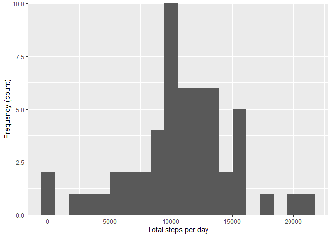
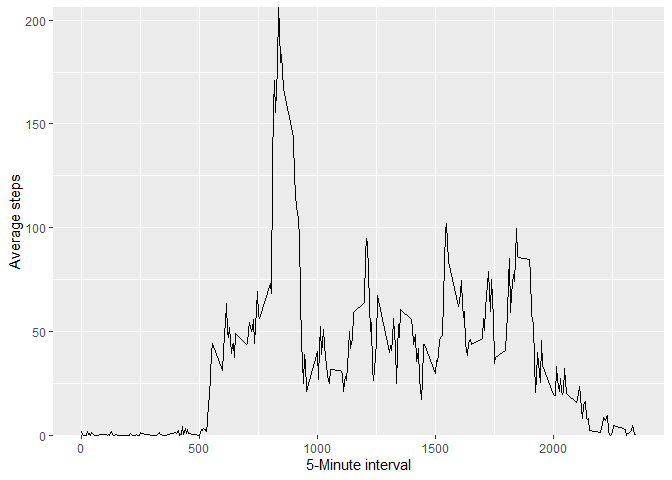
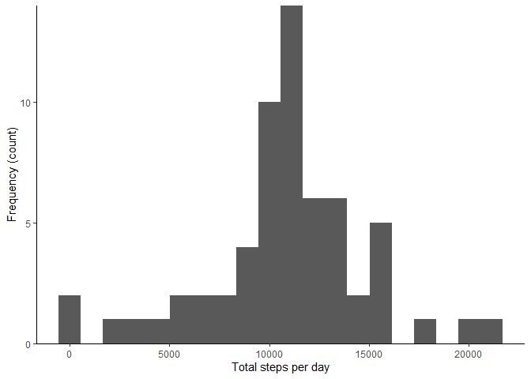
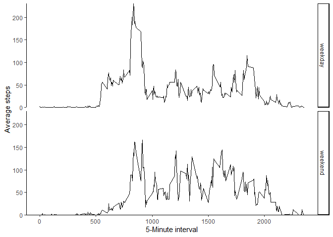

```r
library(dplyr)
library(ggplot2)
library(Hmisc)
```

## Loading and preprocessing the data

```r
raw <- read.csv('activity.csv', stringsAsFactors = F)#Load data
raw$date <- as.POSIXct(raw$date, format = '%Y-%m-%d')# Processing Data
```
## What is mean total number of steps taken per day?

```r
Q1data <- group_by(raw[complete.cases(raw), ], date) %>% summarise(total = sum(steps, na.rm = T))
```


```r
ggplot(Q1data, aes(x = total)) +
  geom_histogram(bins = 20) + 
  xlab('Total steps per day') +
  ylab('Frequency (count)') + 
  scale_y_continuous(expand = c(0, 0))
```

<!-- -->

```r
cat('Mean of the total number of steps taken per day:', mean(Q1data$total))
```

```
## Mean of the total number of steps taken per day: 10766.19
```

```r
cat('\n')
```

```r
cat('Median of the total number of steps taken per day:', median(Q1data$total))
```

```
## Median of the total number of steps taken per day: 10765
```


## What is the average daily activity pattern?

```r
Q2data <- group_by(raw, interval) %>% 
   summarise(mean = mean(steps, na.rm = T))
ggplot(Q2data, aes(x = interval, y = mean)) +
  geom_line() +
  xlab('5-Minute interval') +
  ylab('Average steps') +
  scale_y_continuous(expand = c(0, 0))
```

<!-- -->

```r
cat('The', Q2data[which.max(Q2data$mean), ]$interval, 'th interval contains the maximum mean number of steps:', Q2data[which.max(Q2data$mean), ]$mean)
```

```
## The 835 th interval contains the maximum mean number of steps: 206.1698
```

## Imputing missing values

```r
sum(is.na(raw$steps))
```

```
## [1] 2304
```

```r
sum(is.na(raw$date))
```

```
## [1] 0
```

```r
sum(is.na(raw$interval))
```

```
## [1] 0
```

```r
   #of all three columns, only the step column has na values of 2304
cat('There are', sum(is.na(raw$steps)), 'NAs in the steps column')
```

```
## There are 2304 NAs in the steps column
```

```r
Q3dataDayMean <- group_by(raw, date) %>% summarise(meanStepsPerday = mean(steps))
cat('There are', sum(is.na(Q3dataDayMean$meanStepsPerday)), 'missing values')
```

```
## There are 8 missing values
```

```r
table(is.na(Q2data$mean))
```

```
## 
## FALSE 
##   288
```

```r
fillWithIntMean <- function(query, ref) {
    #This function takes in two dataframes and imputes missing values
    #The query dataframe is the one with missing values
    #The ref dataframe is the one with the values that you want to fill the NAs
  
  imputedData <- c()
    #initiate an empty vector that stores the imputed data
  for (i in 1:nrow(query)) {
    if (is.na(query[i, 'steps']) == T) { #if steps are missing
      imputedData[i] <- ref[ref$interval == query[i, 'interval'], ]$mean
          #first match the interval from the query to the reference
          #then extract the mean steps from the reference
          #and assign that to the imputedData vector
    } else { #steps are not missing
      imputedData[i] <- query[i, 'steps']
          #retain the original data
    }
  }
  
  return(imputedData) #note that a vector is returned!!!
}
```

```r
Q3data <- raw
Q3data <- mutate(Q3data, steps = fillWithIntMean(Q3data, Q2data))
head(Q3data)
```

```
##       steps       date interval
## 1 1.7169811 2012-10-01        0
## 2 0.3396226 2012-10-01        5
## 3 0.1320755 2012-10-01       10
## 4 0.1509434 2012-10-01       15
## 5 0.0754717 2012-10-01       20
## 6 2.0943396 2012-10-01       25
```

```r
Q3data$impSteps2 <- impute(Q3data$steps, fun = rep(Q2data$mean, sum(is.na(Q3data$steps)) / nrow(Q2data)))
head(Q3data)
```

```
##       steps       date interval impSteps2
## 1 1.7169811 2012-10-01        0 1.7169811
## 2 0.3396226 2012-10-01        5 0.3396226
## 3 0.1320755 2012-10-01       10 0.1320755
## 4 0.1509434 2012-10-01       15 0.1509434
## 5 0.0754717 2012-10-01       20 0.0754717
## 6 2.0943396 2012-10-01       25 2.0943396
```

```r
table(Q3data$steps == Q3data$impSteps2)
```

```
## 
##  TRUE 
## 17568
```

```r
Q3data <- Q3data[, -4]
```

```r
Q3data2 <- raw
Q3data$impSteps3 <- impute(Q3data2$steps, fun = mean)
head(Q3data)
```

```
##       steps       date interval impSteps3
## 1 1.7169811 2012-10-01        0   37.3826
## 2 0.3396226 2012-10-01        5   37.3826
## 3 0.1320755 2012-10-01       10   37.3826
## 4 0.1509434 2012-10-01       15   37.3826
## 5 0.0754717 2012-10-01       20   37.3826
## 6 2.0943396 2012-10-01       25   37.3826
```

```r
Q3data <- Q3data[, -4]
```

```r
Q3dataHist <- group_by(Q3data, date) %>% summarise(total = sum(steps))
Q3dataHist$total <- as.integer(Q3dataHist$total)
```

```r
ggplot(Q3dataHist, aes(x = total)) +
  geom_histogram(bins = 20) + 
  xlab('Total steps per day') +
  ylab('Frequency (count)') +
  scale_y_continuous(expand = c(0, 0)) + #remove white space underneath x axis
  theme_classic() #use a minimal theme w/o grids and bg color
```

<!-- -->

```r
cat('Mean of the total number of steps taken per day after filling NAs:', mean(Q3dataHist$total)) 
```

```
## Mean of the total number of steps taken per day after filling NAs: 10766.16
```

```r
cat('Median of the total number of steps taken per day after filling NAs:', median(Q3dataHist$total)) 
```

```
## Median of the total number of steps taken per day after filling NAs: 10766
```

## Are there differences in activity patterns between weekdays and weekends?

```r
Q4data <- Q3data
```

```r
Q4data$day <- ifelse(as.POSIXlt(Q4data$date)$wday %in% c(1:5), 'weekday', 'weekend')
head(Q4data)
```

```
##       steps       date interval     day
## 1 1.7169811 2012-10-01        0 weekday
## 2 0.3396226 2012-10-01        5 weekday
## 3 0.1320755 2012-10-01       10 weekday
## 4 0.1509434 2012-10-01       15 weekday
## 5 0.0754717 2012-10-01       20 weekday
## 6 2.0943396 2012-10-01       25 weekday
```

```r
Q4dataAvg <- Q4data %>% group_by(day, interval) %>% summarise(meanSteps = mean(steps))
```

```
## `summarise()` has grouped output by 'day'. You can override using the `.groups` argument.
```

```r
ggplot(Q4dataAvg, aes(x = interval, y = meanSteps)) +
  geom_line() +
  facet_grid(day ~.) + #indicates row numbers == number of variables in the day col
  xlab('5-Minute interval') +
  ylab('Average steps') +
  scale_y_continuous(expand = c(0, 0)) + #remove white space underneath x axis
  theme_classic() #use a minimal theme w/o grids and bg color
```

<!-- -->
